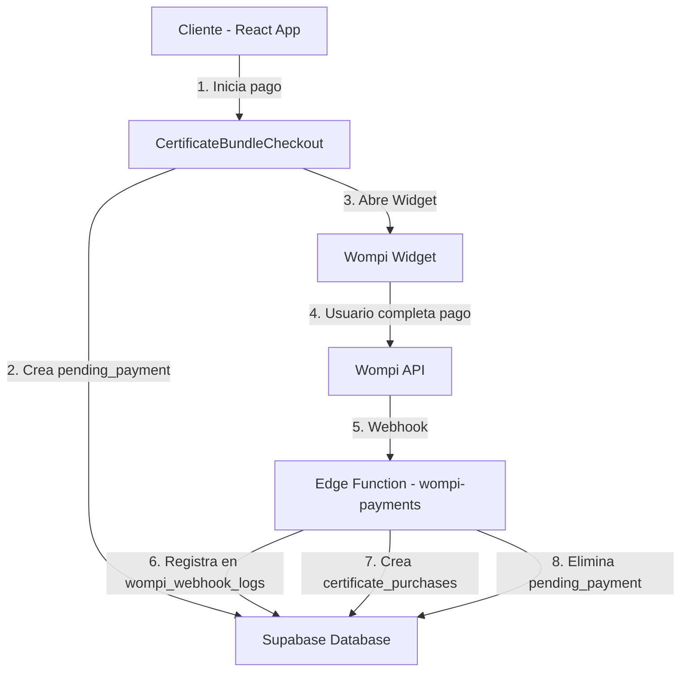

# Integración de Wompi - Documentación Técnica

## 📋 Tabla de Contenidos

1. [Visión General](#visión-general)
2. [Arquitectura](#arquitectura)
3. [Flujo de Pago](#flujo-de-pago)
4. [Configuración](#configuración)
5. [Webhooks](#webhooks)
6. [Monitoreo](#monitoreo)
7. [Troubleshooting](#troubleshooting)
8. [Tarjetas de Prueba](#tarjetas-de-prueba)

---

## Visión General

Veralix utiliza **Wompi** como pasarela de pagos para procesar compras de paquetes de certificados. La integración utiliza:

- **Widget de Wompi**: Para la interfaz de usuario de pago
- **API REST de Wompi**: Para crear transacciones y verificar estados
- **Webhooks**: Para recibir notificaciones de cambios de estado
- **Edge Functions**: Para procesar pagos de forma segura en el backend

---

## Arquitectura

### Componentes Principales



### Componentes de Frontend

1. **`CertificateBundleCheckout.tsx`**: Componente principal de checkout
2. **`useWompiWidget.tsx`**: Hook para interactuar con el Widget de Wompi
3. **`WompiHealthCheck.tsx`**: Verifica la disponibilidad del Widget
4. **`WompiMonitoring.tsx`**: Panel de administración para monitoreo

### Componentes de Backend

1. **`wompi-payments` Edge Function**: Procesa webhooks y transacciones
2. **Tablas de Supabase**:
   - `pending_payments`: Pagos iniciados pero no completados
   - `wompi_webhook_logs`: Registro de todos los webhooks recibidos
   - `certificate_purchases`: Compras completadas

---

## Flujo de Pago

### 1. Inicio del Pago (Frontend)

```typescript
// Usuario hace clic en "Continuar al Pago"
const handlePurchase = async () => {
  // 1. Calcular total con impuestos
  const totalAmount = amount + tax;
  
  // 2. Crear orden única
  const orderId = `VRX-${Date.now()}-${randomString()}`;
  
  // 3. Guardar en pending_payments
  await supabase.from('pending_payments').insert({
    order_id: orderId,
    user_id: user.id,
    amount: totalAmount,
    metadata: { package_info }
  });
  
  // 4. Abrir Widget de Wompi
  openCheckout({
    amountInCents: totalAmount * 100,
    reference: orderId,
    customerEmail: user.email,
    // ... más config
  });
};
```

### 2. Procesamiento del Pago (Wompi)

El usuario completa el pago en la interfaz de Wompi:
- Selecciona método de pago (PSE, tarjeta, Nequi, etc.)
- Ingresa datos de pago
- Wompi procesa la transacción

### 3. Notificación por Webhook (Backend)

```typescript
// Edge Function recibe webhook de Wompi
async function handleWebhook(req: Request, body: any) {
  // 1. Registrar webhook inmediatamente
  const { data: logData } = await supabase
    .from('wompi_webhook_logs')
    .insert({
      event_type: body.event,
      transaction_id: body.data.transaction.id,
      raw_payload: body,
      processed: false
    });

  // 2. Verificar firma del webhook
  const signature = req.headers.get('x-event-signature');
  if (!verifySignature(signature, body)) {
    return error('Invalid signature');
  }

  // 3. Procesar evento
  if (body.data.transaction.status === 'APPROVED') {
    // 3a. Crear certificate_purchase
    await supabase.from('certificate_purchases').insert({
      user_id: pendingPayment.user_id,
      package_name: pendingPayment.metadata.package_name,
      certificates_purchased: count,
      payment_status: 'completed'
    });

    // 3b. Eliminar pending_payment
    await supabase
      .from('pending_payments')
      .delete()
      .eq('order_id', body.data.transaction.reference);

    // 3c. Marcar webhook como procesado
    await supabase
      .from('wompi_webhook_logs')
      .update({ processed: true })
      .eq('id', logData.id);
  }
}
```

---

## Configuración

### 1. Secrets de Supabase

Configurar los siguientes secrets en Supabase Edge Functions:

```bash
WOMPI_PUBLIC_KEY=pub_prod_XXXXXXXX
WOMPI_PRIVATE_KEY=prv_prod_XXXXXXXX
WOMPI_EVENTS_SECRET=events_XXXXXXXX
WOMPI_INTEGRITY_SECRET=integrity_XXXXXXXX
```

### 2. Variables de Entorno (Frontend)

```env
VITE_WOMPI_PUBLIC_KEY=pub_prod_XXXXXXXX
```

### 3. Configuración en Wompi Dashboard

#### A. Dominios Permitidos
Añadir en Wompi Dashboard → Configuración → Dominios:
- `*.lovableproject.com`
- `veralix.io`
- `*.supabase.co`

#### B. URL de Eventos (Webhooks)
Configurar en Wompi Dashboard → Configuración → Eventos:

```
https://hykegpmjnpaupvwptxtl.supabase.co/functions/v1/wompi-payments
```

**Nota**: Asegúrate de que la URL termina en `/wompi-payments` (sin action adicional)

#### C. Eventos a Suscribirse
- `transaction.updated`
- `transaction.created`

---

## Webhooks

### Estructura de un Webhook de Wompi

```json
{
  "event": "transaction.updated",
  "data": {
    "transaction": {
      "id": "123-wompi-456",
      "status": "APPROVED",
      "reference": "VRX-1234567890-abc123",
      "amount_in_cents": 100000,
      "currency": "COP",
      "customer_email": "user@example.com",
      "payment_method_type": "CARD",
      "created_at": "2025-01-17T12:00:00Z"
    }
  },
  "sent_at": "2025-01-17T12:00:01Z",
  "timestamp": 1705492801
}
```

### Estados de Transacción

| Estado | Descripción | Acción |
|--------|-------------|--------|
| `PENDING` | Transacción iniciada | Esperar |
| `APPROVED` | Pago aprobado | Crear `certificate_purchase` |
| `DECLINED` | Pago rechazado | Notificar al usuario |
| `VOIDED` | Pago anulado | Registrar cancelación |
| `ERROR` | Error en el pago | Registrar error |

### Verificación de Firma

```typescript
async function verifySignature(signature: string, payload: any): Promise<boolean> {
  const payloadString = JSON.stringify(payload);
  const expectedSignature = await crypto.subtle.digest(
    'SHA-256',
    new TextEncoder().encode(payloadString + WOMPI_EVENTS_SECRET)
  );
  
  return signature === expectedSignature;
}
```

---

## Monitoreo

### Panel de Administración

Acceder a `/admin/wompi-monitoring` para ver:

1. **Pagos Pendientes**: Transacciones iniciadas pero no completadas
2. **Webhooks Recibidos**: Todos los eventos de Wompi con timestamps
3. **Compras Completadas**: Certificados comprados exitosamente

### Logs en Edge Function

```typescript
// Los logs están disponibles en:
// Supabase Dashboard → Edge Functions → wompi-payments → Logs

console.log('🚀 Creating payment:', { orderId, amount });
console.log('📥 Wompi response:', { status, data });
console.log('🔔 Webhook received:', { event, transactionId });
console.log('✅ Payment approved:', { userId, certificateCount });
```

### Query Útiles

```sql
-- Ver pagos pendientes antiguos (más de 1 hora)
SELECT * FROM pending_payments 
WHERE created_at < NOW() - INTERVAL '1 hour'
ORDER BY created_at DESC;

-- Ver webhooks no procesados
SELECT * FROM wompi_webhook_logs 
WHERE processed = false
ORDER BY created_at DESC;

-- Ver webhooks con errores
SELECT * FROM wompi_webhook_logs 
WHERE processing_error IS NOT NULL
ORDER BY created_at DESC;

-- Ver compras de hoy
SELECT * FROM certificate_purchases 
WHERE purchased_at::date = CURRENT_DATE
ORDER BY purchased_at DESC;
```

---

## Troubleshooting

### Problema: Widget de Wompi no carga

**Síntomas**:
- Consola muestra: `⚠️ Wompi Widget not loaded yet`
- Botón de pago no responde

**Soluciones**:
1. Verificar que el script está en `index.html`:
   ```html
   <script src="https://checkout.wompi.co/widget.js"></script>
   ```

2. Verificar consola del navegador para errores de CSP (Content Security Policy)

3. Deshabilitar bloqueadores de anuncios

4. Verificar que el dominio está permitido en Wompi Dashboard

### Problema: Pago completado pero certificados no se otorgan

**Síntomas**:
- Pago aparece como exitoso en Wompi
- `pending_payment` no se elimina
- No se crea `certificate_purchase`

**Diagnóstico**:
1. Verificar logs de webhooks:
   ```sql
   SELECT * FROM wompi_webhook_logs 
   WHERE transaction_id = 'TRANSACTION_ID'
   ORDER BY created_at DESC;
   ```

2. Verificar si el webhook llegó:
   - Si no hay registro → Problema con URL de eventos
   - Si hay registro pero `processed = false` → Error en procesamiento

3. Ver logs del Edge Function en Supabase Dashboard

**Soluciones**:
1. Verificar URL de eventos en Wompi Dashboard
2. Verificar que `WOMPI_EVENTS_SECRET` está configurado
3. Re-procesar webhook manualmente si es necesario

### Problema: Error de firma de webhook

**Síntomas**:
- Webhook llega pero `signature_valid = false`
- Logs muestran: `❌ Invalid signature`

**Soluciones**:
1. Verificar que `WOMPI_EVENTS_SECRET` coincide con Wompi Dashboard
2. Verificar que no hay caracteres extra o espacios en el secret
3. Regenerar secret en Wompi Dashboard si es necesario

### Problema: Monto incorrecto en Wompi

**Síntomas**:
- Monto mostrado en Wompi no coincide con el esperado
- Error: `amount_in_cents must be at least 100`

**Soluciones**:
1. Verificar conversión a centavos:
   ```typescript
   // ✅ CORRECTO
   const amountInCents = Math.round(totalAmount * 100);
   
   // ❌ INCORRECTO
   const amountInCents = totalAmount; // Falta multiplicar por 100
   ```

2. Verificar parsing del precio:
   ```typescript
   // ✅ CORRECTO
   const amount = parseFloat(pkg.price.replace(/\./g, ''));
   
   // ❌ INCORRECTO
   const amount = parseFloat(pkg.price); // No elimina puntos
   ```

---

## Tarjetas de Prueba

### Ambiente de Producción

**⚠️ IMPORTANTE**: Wompi NO tiene ambiente de pruebas (sandbox). Todas las transacciones en producción son reales y cobran dinero real.

### Para Pruebas en Desarrollo

Si necesitas probar sin cobros reales:

1. **Opción 1**: Usar transacciones de bajo monto (mínimo $100 COP) y luego hacer refunds
2. **Opción 2**: Contactar a Wompi para solicitar una cuenta de pruebas especial
3. **Opción 3**: Usar el diagnóstico de Wompi sin completar pagos

### Diagnóstico sin Pagos Reales

Usar la página de diagnóstico: `/wompi-diagnostics`

Esta página verifica:
- ✅ Credenciales válidas
- ✅ Acceptance token
- ✅ Capacidad de crear transacciones
- ✅ Estado del merchant

---

## Mejores Prácticas

### 1. Siempre Verificar Estados

```typescript
// Nunca asumir que un pago está aprobado sin verificar
if (transaction.status !== 'APPROVED') {
  console.log('Payment not approved:', transaction.status);
  return;
}
```

### 2. Registrar Todo

```typescript
// Logs detallados ayudan enormemente en debugging
console.log('📊 Payment flow:', {
  step: 'create_pending',
  orderId,
  amount,
  userId,
  timestamp: new Date().toISOString()
});
```

### 3. Timeout de Pagos Pendientes

```sql
-- Limpiar pagos pendientes expirados (>24 horas)
DELETE FROM pending_payments 
WHERE expires_at < NOW();
```

### 4. Monitoreo Proactivo

- Revisar panel de monitoreo diariamente
- Configurar alertas para webhooks fallidos
- Revisar pagos pendientes antiguos

### 5. Manejo de Errores

```typescript
try {
  await processPayment(data);
} catch (error) {
  // Log detallado del error
  console.error('Payment error:', {
    error: error.message,
    stack: error.stack,
    data: data,
    timestamp: new Date().toISOString()
  });
  
  // Registrar en webhook_logs si aplica
  await supabase.from('wompi_webhook_logs').update({
    processing_error: error.message
  });
}
```

---

## Contacto y Soporte

- **Documentación Wompi**: https://docs.wompi.co
- **Soporte Wompi**: soporte@wompi.co
- **Dashboard Wompi**: https://comercios.wompi.co

---

## Changelog

### v1.0.0 (2025-01-17)
- ✅ Implementación inicial de integración Wompi
- ✅ Widget de checkout
- ✅ Procesamiento de webhooks
- ✅ Tabla de logs de webhooks
- ✅ Panel de monitoreo admin
- ✅ Health check del Widget
- ✅ Logs mejorados en frontend y backend
